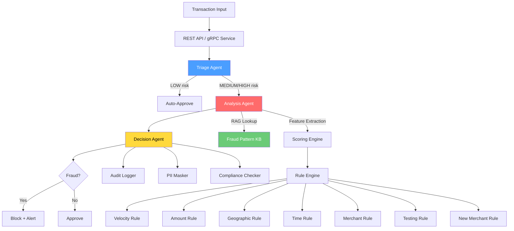

# fintech-fraud-agent

[](https://github.com/gcasti256/fintech-fraud-agent/actions/workflows/ci.yml)
[](https://www.python.org/downloads/)
[](LICENSE)
[](https://github.com/astral-sh/ruff)

An **agentic fraud detection system** for financial services that orchestrates multiple specialized AI agents to analyze transactions in real time. Built with LangGraph for multi-agent coordination, RAG-powered pattern matching against a fraud knowledge base, PII protection for sensitive financial data, and dual gRPC + REST APIs for production deployment.

## Why This Matters

Financial institutions process millions of transactions daily. Traditional rule-based fraud detection systems struggle with sophisticated fraud patterns that evolve over time. This system combines the reliability of deterministic rules with the adaptability of AI agents:

- **Multi-agent architecture** breaks down fraud analysis into specialized stages (triage, analysis, decision), mirroring how fraud investigation teams actually work
- **RAG over a fraud pattern knowledge base** enables the system to match transactions against known fraud typologies without retraining models
- **PII protection** ensures card numbers, SSNs, and account IDs are masked in all logs, API responses, and audit trails — a hard requirement in financial services
- **Dual API surface** (REST + gRPC) supports both synchronous web integrations and high-throughput inter-service communication

## Architecture



### Agent Flow

| Stage | Agent | Purpose | Output |
|-------|-------|---------|--------|
| 1 | **Triage** | Quick risk scoring using rule engine | Risk level (LOW/MEDIUM/HIGH/CRITICAL) |
| 2 | **Analyzer** | Deep pattern matching via RAG + feature extraction | Anomaly flags, pattern matches |
| 3 | **Decision** | Final verdict synthesis with confidence scoring | Fraud/Not-Fraud + explanation |

LOW-risk transactions are auto-approved after triage. MEDIUM and HIGH-risk transactions flow through the full pipeline for deeper analysis.

## Quick Start

### Docker

```bash
docker compose up --build
# REST API: http://localhost:8000
# gRPC: localhost:50051
```

### Manual

```bash
# Clone
git clone https://github.com/gcasti256/fintech-fraud-agent.git
cd fintech-fraud-agent

# Install
python -m venv .venv && source .venv/bin/activate
pip install -e ".[dev]"

# Run REST API
uvicorn fraud_agent.api.rest:create_app --factory --host 0.0.0.0 --port 8000

# Score a transaction via CLI
fraud-agent score -t '{"amount": 5000, "merchant_name": "Lucky Casino", "merchant_category_code": "7995"}'
```

## API Reference

### REST Endpoints

| Method | Path | Description |
|--------|------|-------------|
| `POST` | `/api/v1/score` | Score a single transaction |
| `POST` | `/api/v1/batch` | Score a batch of transactions |
| `GET` | `/api/v1/decisions` | List recent fraud decisions |
| `GET` | `/api/v1/decisions/{id}` | Get decision detail with explanation |
| `GET` | `/api/v1/metrics` | Scoring performance metrics |
| `GET` | `/api/v1/patterns` | List known fraud patterns from KB |
| `GET` | `/health` | Health check |

#### Score a Transaction

```bash
curl -X POST http://localhost:8000/api/v1/score \
  -H "Content-Type: application/json" \
  -d '{
    "amount": 4999.99,
    "merchant_name": "Lucky Stars Casino",
    "merchant_category_code": "7995",
    "card_last_four": "4567",
    "account_id": "ACC-8821-4567",
    "location": {"city": "Macau", "country": "MO", "latitude": 22.19, "longitude": 113.54},
    "channel": "ONLINE",
    "is_international": true
  }'
```

Response:

```json
{
  "transaction_id": "ACC-****-4567",
  "risk_level": "HIGH",
  "fraud_score": 0.7823,
  "is_fraud": true,
  "confidence": 0.85,
  "explanation": "Transaction assessed as FRAUDULENT (score: 0.78). Triggered rules: high_risk_merchant, amount_anomaly. Anomalies: Amount is 66.7x account average; High-risk merchant category code.",
  "rules_triggered": ["high_risk_merchant", "amount_anomaly"],
  "recommended_action": "block_and_review"
}
```

### gRPC Service

Protobuf service definition at `src/fraud_agent/proto/fraud_scoring.proto`:

```protobuf
service FraudScoringService {
  rpc ScoreTransaction(TransactionRequest) returns (FraudScore);
  rpc BatchScore(BatchRequest) returns (BatchResponse);
  rpc GetDecision(DecisionRequest) returns (DecisionDetail);
}
```

Compile proto stubs:

```bash
python -m grpc_tools.protoc \
  -Isrc/fraud_agent/proto \
  --python_out=src/fraud_agent/proto \
  --grpc_python_out=src/fraud_agent/proto \
  src/fraud_agent/proto/fraud_scoring.proto
```

## Fraud Detection Rules

| Rule | Trigger Condition | Risk Contribution |
|------|-------------------|-------------------|
| **Velocity** | >5 transactions in 10 minutes | 0.90 |
| **Amount** | Transaction >3x account average | Proportional to ratio |
| **Geographic** | >500 miles from typical location in <2 hours | 0.85 |
| **Time** | Transaction between 2-5 AM local time | 0.30 |
| **Merchant** | High-risk MCC (gambling, crypto, wire transfer) | 0.50 |
| **Card Testing** | Sub-$2 charge followed by >$500 within 1 hour | 0.95 |
| **New Merchant** | First-time merchant + amount > $200 | 0.40 |

## Knowledge Base

The RAG system retrieves relevant fraud patterns from a curated knowledge base of 15+ pattern types:

- Card testing attacks (small probing charges)
- Account takeover indicators
- Synthetic identity fraud signals
- Geographic impossibility patterns
- Velocity abuse schemes
- Cross-border fraud typologies
- Merchant collusion indicators
- Bust-out fraud patterns
- Friendly fraud / chargeback abuse
- And more

Patterns are embedded using a lightweight TF-IDF-style vector representation and retrieved via cosine similarity search — no external embedding API required.

## CLI

```bash
# Score a single transaction
fraud-agent score -t '{"amount": 5000, "merchant_name": "Casino", "merchant_category_code": "7995"}'

# Batch scoring from file
fraud-agent batch -f transactions.json

# Generate synthetic test data
fraud-agent generate --count 1000 --fraud-rate 0.05 --output test_data.json

# List fraud patterns
fraud-agent patterns list

# View metrics
fraud-agent metrics
```

## Security & Compliance

### PII Protection

All personally identifiable information is masked before logging or API output:

| Data Type | Raw | Masked |
|-----------|-----|--------|
| Card Number | `4532-1234-5678-7890` | `4532-****-****-7890` |
| SSN | `123-45-6789` | `***-**-6789` |
| Account ID | `ACC-8821-4567` | `ACC-****-4567` |
| Email | `george@example.com` | `g***@example.com` |

### Audit Trail

Every fraud decision is logged to a tamper-evident audit trail with SHA-256 chain hashing. Each entry's hash incorporates the previous entry's hash, forming an integrity chain that detects any modification or deletion.

### Compliance Checks

- **CTR Reporting**: Flags transactions >= $10,000 (FinCEN 31 CFR 1010.311)
- **Structuring Detection**: Flags transactions in $8,000-$9,999 range (31 USC 5324)
- **International Wire Transfers**: Flags cross-border wire transfers (31 CFR 1010.340)
- **Sanctioned Countries**: Flags transactions involving OFAC-sanctioned jurisdictions

## Performance

The scoring engine tracks real-time performance metrics:

- **Latency**: Average, P95, and P99 scoring latency
- **Throughput**: Transactions scored per second
- **Accuracy**: Fraud detection rate and risk distribution
- **Rule performance**: Per-rule trigger rates

Access via `GET /api/v1/metrics` or `fraud-agent metrics`.

## Development

```bash
# Install dev dependencies
pip install -e ".[dev]"

# Run tests
pytest

# Run tests with coverage
pytest --cov=fraud_agent --cov-report=term-missing

# Lint
ruff check src/ tests/

# Format
ruff format src/ tests/

# Type check
mypy src/fraud_agent/
```

## Tech Stack

- **Python 3.11+** — core runtime
- **LangGraph** — multi-agent orchestration with StateGraph
- **FastAPI** — REST API with async support
- **gRPC** — high-performance scoring service
- **Pydantic v2** — data validation and serialization
- **NumPy + scikit-learn** — feature extraction and scoring models
- **structlog** — structured JSON logging
- **Rich** — CLI output formatting
- **SQLite** — decision and audit log persistence
- **Docker** — containerized deployment

## Project Structure

```
src/fraud_agent/
├── agents/           # LangGraph multi-agent pipeline
│   ├── triage.py     # Initial risk scoring and routing
│   ├── analyzer.py   # Deep pattern matching + RAG
│   ├── decision.py   # Final verdict with explanation
│   └── orchestrator.py # LangGraph StateGraph wiring
├── scoring/          # Fraud scoring engine
│   ├── engine.py     # Rule + model scoring orchestration
│   ├── rules.py      # 7 configurable fraud detection rules
│   ├── features.py   # Feature extraction from transactions
│   └── models.py     # Pluggable scoring models
├── data/             # Data layer
│   ├── schemas.py    # Pydantic models (Transaction, Account, etc.)
│   ├── generator.py  # Synthetic transaction data generator
│   └── knowledge_base.py # RAG fraud pattern knowledge base
├── rag/              # Retrieval-Augmented Generation
│   ├── embeddings.py # Lightweight TF-IDF embeddings
│   ├── store.py      # NumPy cosine similarity vector store
│   └── retriever.py  # Fraud pattern retrieval
├── guardrails/       # Safety and compliance
│   ├── pii_masker.py # PII detection and masking
│   ├── audit_logger.py # Tamper-evident audit trail
│   └── compliance.py # Regulatory compliance checks
├── api/              # Service layer
│   ├── rest.py       # FastAPI REST endpoints
│   ├── grpc_server.py # gRPC scoring service
│   └── grpc_client.py # gRPC test client
├── monitoring/       # Observability
│   ├── metrics.py    # Latency, throughput, accuracy tracking
│   └── dashboard.py  # Text-based metrics dashboard
├── proto/            # Protocol Buffers
│   └── fraud_scoring.proto
├── cli.py            # Click CLI
├── config.py         # Pydantic Settings configuration
└── db.py             # SQLite persistence
```

## License

MIT
